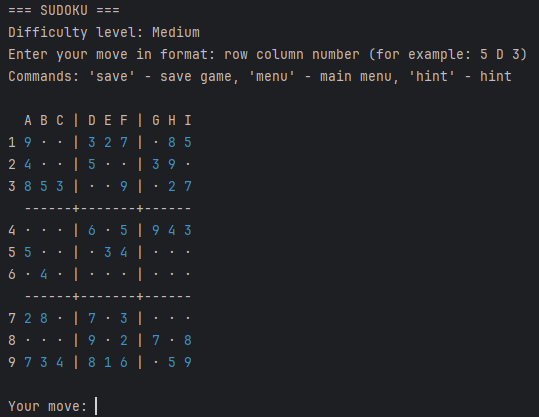

# SUDOKU CLI

A Kotlin-based console implementation of the classic Sudoku puzzle. The game generates random boards and provides a minimalist interface for solving puzzles.



## Features

- Random board generation with varying difficulty levels
- Simple console-based interface
- Command hints and help system
- Input format validation

## Quick start

### Installation

1. Clone the repository:
```bash
git clone https://github.com/mmiheev/sudoku-cli.git
cd sudoku-cli
```

2. Build the project using Gradle:
```bash
./gradlew build
```

3. Run the game:
```bash
./gradlew run
```

## Contributing

I welcome contributions! Please follow these steps:

1. Fork the repository
2. Create a feature branch (`git checkout -b feature-name`)
3. Commit your changes (`git commit -m 'Add some new feature'`)
4. Push to the branch (`git push origin feature-name`)
5. Open a Pull Request

## Support

If you encounter any issues or have questions:

- Create an Issue in the repository
- Check existing Issues before creating a new one
- Provide detailed description of the problem